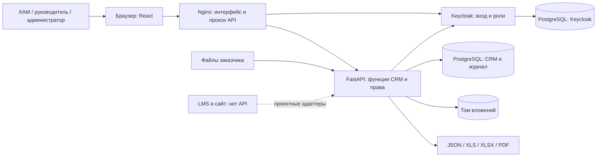

# Функциональная и компонентная архитектура

## Функциональные блоки

КАМ ведёт вуз, взаимодействие, программы и задачи; руководитель контролирует работу и отчёты; технический администратор обслуживает платформу. Отдельные функции: справочники и импорт файлов, договоры, анкеты слушателей и заявки, сигналы антифрода, аналитика, отчёты и журнал действий. Реальный набор доступных операций зависит от роли и назначения вуза; исходные правила находятся в `backend/app/auth.py`, `catalog_routes.py`, `task_policy.py` и маршрутах конкретного раздела.

Сервис не встроен в корпоративный монолит. Он запускается как отдельный набор контейнеров и предоставляет HTTP API с OpenAPI. Форматы экспорта дают выход для других систем, но не обещают автоматическую интеграцию без согласованного контракта.

## Компоненты и поток

Nginx отдаёт интерфейс и маршрутизирует `/api` и `/auth`. FastAPI применяет права доступа до выборки данных, выполняет бизнес-правила и формирует файлы. Keycloak отвечает за личность и роли, CRM хранит назначение менеджеров на вузы. PostgreSQL хранит прикладные записи и журнал; вложения находятся в отдельном томе. По умолчанию сетевые порты Docker Compose открыты только на `127.0.0.1`.

Ключевые пути в исходном коде: `backend/app/main.py` — состав API; `backend/app/models.py` и `backend/migrations/` — данные; `backend/app/analytics_routes.py`, `analytics_metrics.py` — аналитика; `backend/app/report_routes.py` — отчёты; `backend/app/importer.py` и `import_routes.py` — загрузка справочников; `backend/app/fraud_*` — сигналы антифрода; `frontend/src/pages/` — интерфейс. `compose.yaml` описывает независимые контейнеры; `compose.public.yaml` — особенности текущего публичного размещения, а не требование для Linux.

## Модель Archi

[`unicrm-architecture.xml`](unicrm-architecture.xml) использует ArchiMate 3.x Model Exchange XML с компонентами приложения, системным ПО, данными и связями. В Archi: **File → Import → Model From Open Exchange File**, выбрать XML; затем проверить имена и связи и, при необходимости, расположить элементы на диаграмме. XML содержит семантическую модель, без координат представления. Это не файл проекта `.archimate` и не подтверждение импорта в установленную у заказчика версию Archi.

Формат обмена описан [The Open Group](https://www.opengroup.org/open-group-archimate-model-exchange-file-format); [Archi CLI](https://github.com/archimatetool/archi/wiki/Archi-Command-Line-Interface) также поддерживает импорт XML обмена.
