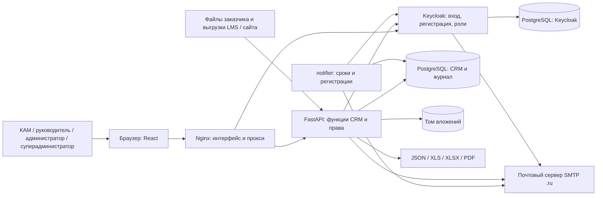

# Функциональная и компонентная архитектура

## Функциональные блоки

- **Работа с данными (КАМ, руководитель):** учебные заведения (с адресом электронной почты вуза), договоры, взаимодействия с этапами процесса, история статусов с комментариями и файлами, задачи и планы задач. Реестр взаимодействий фильтруется по вузу, ИТ-программе, ИТ-продукту и статусу.
- **Процессы:** руководитель и администратор настраивают шаблоны процессов и их статусы («Процессы»).
- **Аналитика и отчёты:** воронка, внедрения по месяцам, рейтинг; отчёт по взаимодействиям за период по вузам, ИТ-направлениям, ИТ-продуктам, ответственным и статусам в XLS, XLSX, PDF и JSON.
- **Справочники и загрузка файлов:** каталог вузов, ИТ-направлений и продуктов; импорт Excel с предварительным просмотром. Через эту же загрузку поступают выгрузки LMS и сайта ИТ Школы (D-243).
- **Доступ и администрирование:** вход и регистрация через Keycloak; суперадминистратор выдаёт доступ, меняет и удаляет роли, отправляет письмо для установки пароля и передаёт права суперадминистратора администраторам; снять их может только главный суперадминистратор. Руководитель и администратор назначают КАМ на вузы и решают, видят ли вуз все КАМ.
- **Уведомления:** колокольчик в интерфейсе; служба `notifier` создаёт напоминания о сроках и раз в минуту проверяет новые регистрации (уведомление суперадминистраторам, письмо администратору и заявителю).
- **Сведения о персональных данных:** демонстрационные версии двух политик (.docx) скачиваются в «Настройки → Персональные данные».
- **Журнал действий и резервные копии.**

Разделы «Слушатели», «Компании», «Заявки на курсы», «Загрузка данных» и «Проверка сигналов» выведены из продукта (D-235, D-236); их код хранится в `archive/customer-data`, серверные маршруты выключены.

Сервис не встроен в корпоративный монолит. Он запускается как отдельный набор контейнеров и предоставляет HTTP API с OpenAPI (Swagger UI — `/api/docs`). Форматы экспорта дают выход для других систем, но не обещают автоматическую интеграцию без согласованного контракта.

## Компоненты и поток

Nginx отдаёт интерфейс и маршрутизирует `/api` и `/auth`. FastAPI применяет права доступа до выборки данных, выполняет бизнес-правила и формирует файлы. Keycloak отвечает за личность, регистрацию и роли (`crm-superadmin` — составная роль, включающая `crm-admin` и `crm-supervisor`); CRM хранит назначение КАМ на вузы и признак «Видят все КАМ». Служба `notifier` использует тот же образ, что и API, но отдельную точку входа. Почта (подтверждение адреса, письма о заявках, установка пароля) уходит только через российский SMTP-ящик. PostgreSQL хранит прикладные записи и журнал; вложения находятся в отдельном томе. По умолчанию сетевые порты Docker Compose открыты только на `127.0.0.1`.

Ключевые пути в исходном коде: `backend/app/main.py` — состав API; `backend/app/models.py` и `backend/migrations/` — данные; `analytics_routes.py`, `analytics_metrics.py` — аналитика; `report_routes.py` — отчёты; `importer.py`, `import_routes.py` — загрузка справочников; `admin_routes.py` — пользователи, роли и права суперадминистратора; `catalog_routes.py` — вузы, назначения и видимость; `notification_scheduler.py`, `registration_watch.py` — служба уведомлений и проверка регистраций; `email.py` — почта; `policy_routes.py` и `policy_documents/` — политики; `deploy/keycloak/themes/edu-crm` — оформление страниц входа и писем Keycloak; `frontend/src/pages/` — интерфейс. `compose.yaml` описывает независимые контейнеры; `compose.public.yaml` — особенности текущего публичного размещения, а не требование для Linux.

## Модель Archi

[`unicrm-architecture.xml`](unicrm-architecture.xml) использует ArchiMate 3.x Model Exchange XML с ролями, компонентами приложения, функциями, системным ПО, данными и связями. В Archi: **File → Import → Model From Open Exchange File**, выбрать XML; затем проверить имена и связи и, при необходимости, расположить элементы на диаграмме. XML содержит семантическую модель, без координат представления. Это не файл проекта `.archimate` и не подтверждение импорта в установленную у заказчика версию Archi.

Формат обмена описан [The Open Group](https://www.opengroup.org/open-group-archimate-model-exchange-file-format); [Archi CLI](https://github.com/archimatetool/archi/wiki/Archi-Command-Line-Interface) также поддерживает импорт XML обмена.
