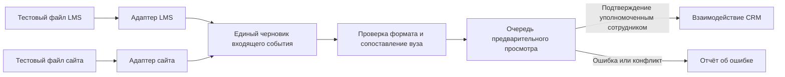

# LMS и сайт: постоянные заглушки

> **Статус (29.09.2026): не реализуется.** Владелец решил, что данные LMS и сайта загружаются файлами выгрузок через «Загрузку справочников» (D-243). Документ сохранён как справочный проект.

Статус: решение владельца от 28 сентября 2026 года — LMS и сайт **всегда остаются на заглушках**. Действующий обмен по API не планируется. Описанная ниже схема заглушек пока является проектом, а не работающим коннектором. CRM не должна показывать пробные записи как полученные из LMS или с сайта Ростелекома.

## Задача и граница источников

По исходному ТЗ LMS и сайт названы источниками. С учётом решения владельца их место в архитектуре занимают явно обозначенные локальные заглушки с синтетическими данными. Для рабочего наполнения доступны переданные заказчиком файлы и ручной ввод. Загрузка файлов идёт через отдельный импорт с предварительным просмотром и журналом; она не имитирует вызов LMS или сайта. Статус оплаты из файла `Данные оплат.json` остаётся `unconfirmed_by_data`, пока достоверное подтверждение оплаты не определено отдельно.

Заглушки проверяются на синтетических JSON. В рабочей системе нет расписания опроса, ключей внешних систем и открытого маршрута приёма «боевых» сообщений. Синтетические записи должны иметь метку источника `mock_lms` или `mock_website` и не смешиваться с подтверждёнными данными в отчётах.

## Предлагаемый поток



Адаптеры в схеме знают **внутренний формат заглушки**, а не внешний API. Они не заменяются реальными коннекторами в рамках текущего решения. Изменение этого правила возможно только по новой явной постановке задачи владельца.

## Внутренний черновик для тестов

Следующая структура — **наше внутреннее представление**, а не обещание формата внешнего API:

```json
{
  "source": "mock_lms",
  "external_id": "synthetic-lms-001",
  "event_type": "course_enrolment",
  "occurred_at": "2026-09-27T10:00:00Z",
  "university_reference": "МФТИ",
  "payload": {"program_name": "Тестовая программа"}
}
```

`source` различает две заглушки; при реализации использовать явные значения `mock_lms` и `mock_website`. `external_id` вместе с `source` служит ключом повтора. `event_type`, время и поля `payload` — внутренняя версионируемая схема, а не обещание внешнего API. Синтетические поля не становятся обязательными полями CRM автоматически. В тестах нужны одинаковый `external_id` у разных заглушек, повтор, исправление, неизвестный вуз и неполная запись.

## Правила обработки

1. Полученное сообщение сначала проверяется и попадает в предварительный просмотр. Неизвестный вуз, неоднозначное совпадение названия и несовпадение с назначенным менеджером требуют ручного решения. Интеграция сама не создаёт вуз или пользователя; новый вуз можно добавить в «Настройки → Учебные заведения» и затем повторить сопоставление.
2. Ключ `(source, external_id)` и контрольная сумма нормализованного содержимого делают повторную доставку безопасной: точный повтор ничего не меняет; изменённая версия создаёт новую запись для рассмотрения. Изменение статуса, ответственного, договора и признака оплаты нельзя применять автоматически только по внешнему сообщению.
3. При подтверждении оператор выбирает существующее взаимодействие либо создаёт новое в пределах разрешённого ему вуза. Связь с внешней записью и исходный источник сохраняются отдельно от бизнес-полей CRM. Отказ, ошибка и повтор также журналируются без секретов и лишних персональных данных.
4. Доступ к просмотру входящих сообщений и их подтверждению должен проверяться на сервере по роли и вузу. Данные заглушек не содержат настоящих ФИО, телефонов или анкет. Для хранилища заглушек отдельно задаются срок хранения и порядок удаления.
5. Сбой источника или обработки не останавливает ручную работу в CRM. Неподтверждённое событие не попадает в отчёты как завершённое взаимодействие или подтверждённая оплата.

## Что требуется для реализации постоянных заглушек

- Внутренняя версия схемы JSON и небольшой набор обезличенных фикстур с явной маркировкой «Заглушка LMS» и «Заглушка сайта».
- Детерминированные идентификаторы, правила повтора, исправления и сброса данных заглушки.
- Правило отображения: показатели заглушки никогда не называются реальными данными LMS/сайта и не попадают в боевые отчёты без отдельного подтверждения оператором и сохранения происхождения.
- Проверки прав, журнала, отсутствия настоящих персональных данных и выключенного сетевого обмена.

Ветку `ai/integration-candidate` нельзя переносить в рабочий API как готовую интеграцию: там придуманы внешние поля и общий секрет для двух источников. При необходимости можно отдельно переиспользовать только проверенные идеи идемпотентности для внутренних заглушек.

## Критерии готовности заглушек

На обезличенных примерах каждой заглушки проверены сопоставление, повторы, исправления, ошибки и права доступа; результат предварительного просмотра согласован владельцем данных. Заглушки выключаются независимо и не влияют на ручной ввод и импорт файлов. Нет сетевых вызовов LMS/сайта, их ключей и заявления о получении реальных событий.
