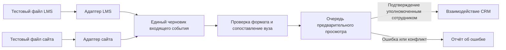

# LMS и сайт: работа с заглушками до получения API

Статус: согласованная проектная схема, **не действующая интеграция**. На 27 сентября 2026 года доступ к API LMS и сайта не предоставляется. Форматы их ответов, способ авторизации и состав разрешённых полей неизвестны. CRM не должна показывать пробные записи как полученные от Ростелекома.

## Задача и граница источников

По ТЗ данные из LMS и сайта должны попадать в существующее или новое взаимодействие с вузом. Сейчас доступны только переданные заказчиком файлы и ручной ввод. Загрузка файлов идёт через отдельный импорт с предварительным просмотром и журналом; она не имитирует вызов LMS или сайта. Статус оплаты из файла `Данные оплат.json` остаётся `unconfirmed_by_data`, пока достоверное подтверждение оплаты не определено отдельно.

Пробная интеграция запускается **только в тестовой среде** на синтетических JSON. В рабочей системе нет расписания опроса, ключей внешних систем и открытого маршрута приёма «боевых» сообщений.

## Предлагаемый поток



Адаптеры знают формат конкретного источника; общие проверки и запись в CRM не зависят от него. Когда поставщики передадут реальные контракты, заменятся адаптеры, а правила сопоставления, защиты от повторов и аудита останутся общими.

## Внутренний черновик для тестов

Следующая структура — **наше внутреннее представление**, а не обещание формата внешнего API:

```json
{
  "source": "lms",
  "external_id": "synthetic-lms-001",
  "event_type": "course_enrolment",
  "occurred_at": "2026-09-27T10:00:00Z",
  "university_reference": "МФТИ",
  "payload": {"program_name": "Тестовая программа"}
}
```

`source` отличает LMS от сайта; `external_id` вместе с `source` служит ключом повтора. `event_type`, время и поля `payload` будут утверждены после получения реальных примеров. Синтетические поля не становятся обязательными полями CRM автоматически. В тестах должны быть отдельные сообщения с одним `external_id` от двух источников, повтор одного сообщения, исправление сообщения, неизвестный вуз и неполная запись.

## Правила обработки

1. Полученное сообщение сначала проверяется и попадает в предварительный просмотр. Неизвестный вуз, неоднозначное совпадение названия и несовпадение с назначенным менеджером требуют ручного решения. Интеграция сама не создаёт вуз или пользователя; новый вуз можно добавить в «Настройки → Учебные заведения» и затем повторить сопоставление.
2. Ключ `(source, external_id)` и контрольная сумма нормализованного содержимого делают повторную доставку безопасной: точный повтор ничего не меняет; изменённая версия создаёт новую запись для рассмотрения. Изменение статуса, ответственного, договора и признака оплаты нельзя применять автоматически только по внешнему сообщению.
3. При подтверждении оператор выбирает существующее взаимодействие либо создаёт новое в пределах разрешённого ему вуза. Связь с внешней записью и исходный источник сохраняются отдельно от бизнес-полей CRM. Отказ, ошибка и повтор также журналируются без секретов и лишних персональных данных.
4. Доступ к просмотру входящих сообщений и их подтверждению должен проверяться на сервере по роли и вузу. Тестовые данные не содержат настоящих ФИО, телефонов или анкет. После согласования договора обмена нужно определить срок хранения входящих сообщений, набор персональных полей и способ удаления.
5. Сбой источника или обработки не останавливает ручную работу в CRM. Неподтверждённое событие не попадает в отчёты как завершённое взаимодействие или подтверждённая оплата.

## Что потребуется от владельцев LMS и сайта

- По одному обезличенному примеру на каждое событие, которое нужно получать, и описание полей, форматов дат, кодов статусов и стабильных идентификаторов.
- Направление обмена: CRM забирает данные по расписанию, источники отправляют события или нужны оба варианта; правила повторов, исправлений, удаления и пагинации.
- Адреса тестового и рабочего API, способ аутентификации, сетевые ограничения, лимиты запросов и контакты для разбора ошибок.
- Утверждённое соответствие полей LMS/сайта полям CRM, особенно идентификатор вуза, ответственный, статус взаимодействия и признак оплаты.
- Требования к персональным данным: разрешённые поля, основание передачи, срок хранения, разграничение доступа и место журналирования.

До получения этих сведений нельзя считать контракт из ветки `ai/integration-candidate` настоящим. Он полезен как прототип идемпотентности, но в нём придуманы внешние поля и общий секрет для двух источников; прямой перенос в рабочий API закрепил бы непроверенные предположения.

## Критерии будущего подключения

На обезличенных примерах каждого источника проверены сопоставление, повторы, исправления, ошибки и права доступа; результаты предварительного просмотра сверены с владельцем данных. Подтверждены правила изменения статуса и оплаты. Затем адаптеры включаются по отдельным настройкам для тестовой и рабочей среды, а отключение любого источника не влияет на ручной ввод и импорт файлов.
